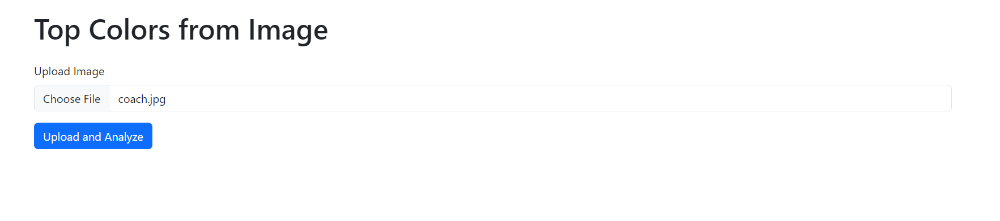
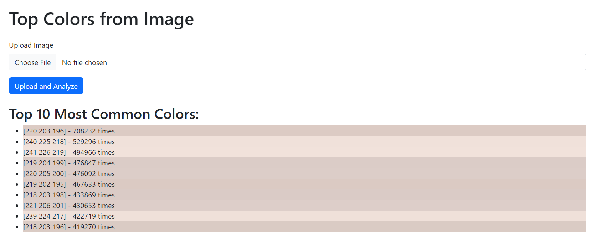

# Image Color Analyzer
  This web application allows users to upload an image and discover the top colors present in the image.

## Features
- **Image Upload:** Users can upload an image file.
- **Color Analysis:** Analyzes the uploaded image to find the most common colors.
- **Display:** Displays the top 10 most common colors present in the uploaded image.

## Technologies Used
- Python
- FLASK
- PIL (Python Imaging Library)
- NumPy
- Bootstrap 5

## Getting Started
  - **Fork the repository:** You should **fork the repository** and then **clone it** so you can manage your own repo and use this only as a template.
    ```
    $ git clone https://github.com/your_username/your-flask-project.git
    ```
  - **Install dependencies:**
  
    ```
    pip install -r requirements.txt
    ```
  - **Set Environment Variables:** Ensure you have the required environment variables set, such as IMAGE_SECRET_KEY for Flask.
    
  - **Run the Application:**
  
      ```
       python main.py
      ```
  
  - **Access the Application:** Open your web browser and navigate to http://localhost:5000 to access the application.

## Screenshots
 - Upload the file:    
   <div align="center"></div>

 - Analyze the file:    
   <div align="center"></div>
     
     
